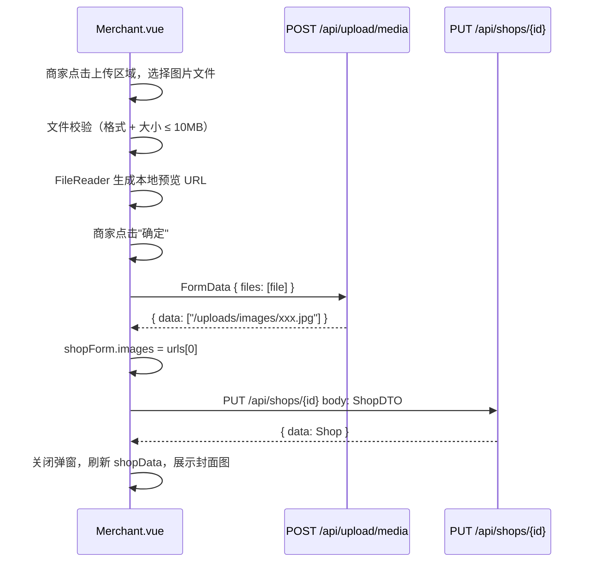

# Design Document: shop-cover-upload

## Overview

在商家管理后台"编辑店铺资料"弹窗中新增封面图片上传功能。商家可选择本地图片文件，前端在提交表单时先调用已有的 `POST /api/upload/media` 接口上传图片，获取 URL 后写入 `shopForm.images`，再调用 `PUT /api/shops/{id}` 保存店铺资料。保存成功后，"店铺基础资料"标签页展示封面图片。

后端 `ShopDTO` 和 `Shop` 实体均已包含 `images` 字段，`ShopService.copyDtoToShop` 已将该字段持久化，因此后端无需修改，改动集中在前端 `Merchant.vue`。

---

## Architecture



---

## Components and Interfaces

### 前端：Merchant.vue 改动

#### 新增响应式状态

| 变量 | 类型 | 说明 |
|------|------|------|
| `coverFile` | `ref(null)` | 用户选择的原始 File 对象，未选择时为 null |
| `coverPreviewUrl` | `ref('')` | 本地预览 URL（`URL.createObjectURL` 或 `FileReader`） |
| `coverUploading` | `ref(false)` | 上传中标志，用于禁用"确定"按钮 |

#### shopForm 新增字段

```js
shopForm.value = {
  // ...已有字段
  images: shopData.value?.images || ''
}
```

#### 封面上传区域（嵌入编辑弹窗 `<el-form>` 末尾）

```html
<el-form-item label="封面图片">
  <div class="cover-uploader" @click="triggerFileInput">
    
    <div v-else class="cover-placeholder">
      <el-icon :size="32"><Plus /></el-icon>
      <span>点击上传封面图</span>
    </div>
  </div>
  <input
    ref="fileInputRef"
    type="file"
    accept=".jpg,.jpeg,.png,.webp"
    style="display:none"
    @change="onFileChange"
  />
</el-form-item>
```

#### 关键函数

- `triggerFileInput()`：调用 `fileInputRef.value.click()`
- `onFileChange(event)`：读取文件，校验格式与大小，生成本地预览
- `uploadCover()`：构造 `FormData`，调用 `upload.media()`，返回 URL
- `submitShop()`（修改）：若 `coverFile` 不为 null，先 `await uploadCover()`，失败则中止；成功后继续原有保存逻辑

#### 店铺基础资料展示区（Shop_Info_Panel）

在现有 `<template v-if="shopData">` 块顶部新增：

```html
<div v-if="shopData.images" class="shop-cover-wrap">
  
</div>
```

### 后端：无需修改

- `ShopDTO.images`：已存在（`String` 类型）
- `ShopService.copyDtoToShop`：已调用 `shop.setImages(dto.getImages())`
- `ShopController.update`：已接受完整 `ShopDTO` 并返回更新后的 `Shop`
- `UploadController.uploadMedia`：已支持 jpg/jpeg/png/webp，已校验 10MB 限制

---

## Data Models

### 前端表单数据流

```
用户选择文件
  → coverFile (File)
  → coverPreviewUrl (blob URL，仅用于预览)
  → [提交时] upload.media(FormData) → URL string
  → shopForm.images = URL
  → shop.update(id, shopForm) → Shop
  → shopData.images = URL（刷新后展示）
```

### 后端数据模型（已有，无需变更）

```java
// ShopDTO
String images;  // 封面图片 URL

// Shop 实体
String images;  // 对应数据库 shop.images 列
```

### API 契约

**上传接口**
```
POST /api/upload/media
Content-Type: multipart/form-data
Body: files=[File]

Response: { "code": 200, "data": ["/uploads/images/{uuid}.jpg"] }
```

**店铺更新接口**
```
PUT /api/shops/{id}
Content-Type: application/json
Body: { "name": "...", "images": "/uploads/images/{uuid}.jpg", ... }

Response: { "code": 200, "data": { "id": 1, "images": "/uploads/images/{uuid}.jpg", ... } }
```

---

## Error Handling

| 场景 | 处理方式 |
|------|----------|
| 文件格式不合法（非 jpg/jpeg/png/webp） | `ElMessage.error('仅支持 jpg、jpeg、png、webp 格式')` |
| 文件大小超过 10MB | `ElMessage.error('图片大小不能超过 10MB')`，清空选择 |
| `Upload_API` 调用失败 | `ElMessage.error('封面图片上传失败，请重试')`，终止保存，`coverUploading = false` |
| `Shop_API` 调用失败 | 已有逻辑：`ElMessage.error(error.message \|\| '操作失败，请重试')` |
| 弹窗关闭时 | 重置 `coverFile = null`，`coverPreviewUrl = ''` |

---


## Correctness Properties

*A property is a characteristic or behavior that should hold true across all valid executions of a system — essentially, a formal statement about what the system should do. Properties serve as the bridge between human-readable specifications and machine-verifiable correctness guarantees.*

### Property 1: 已有封面图片时弹窗预览初始化

*For any* 包含非空 `images` 字段的 `shopData`，打开"编辑店铺资料"弹窗后，`coverPreviewUrl` 的值应等于 `shopData.images`。

**Validates: Requirements 1.2**

---

### Property 2: 超大文件被拒绝

*For any* 大小超过 10MB 的文件对象，调用 `onFileChange` 后，`coverFile` 应保持为 `null`，`coverPreviewUrl` 应保持为空字符串。

**Validates: Requirements 2.2**

---

### Property 3: 合法文件生成预览

*For any* 格式为 jpg/jpeg/png/webp 且大小不超过 10MB 的文件对象，调用 `onFileChange` 后，`coverFile` 应等于该文件，`coverPreviewUrl` 应为非空字符串。

**Validates: Requirements 2.3**

---

### Property 4: 上传成功后 images 字段使用第一个 URL

*For any* 已选择合法封面文件的提交操作，`Upload_API` 被调用且成功返回 URL 列表后，传递给 `Shop_API` 的 `ShopDTO.images` 应等于返回列表中的第一个 URL。

**Validates: Requirements 3.1, 3.2**

---

### Property 5: 上传失败时终止保存

*For any* `Upload_API` 调用失败的情况，`Shop_API`（`PUT /api/shops/{id}`）不应被调用，`shopForm` 保持不变。

**Validates: Requirements 3.3**

---

### Property 6: 上传中禁用确定按钮

*For any* `coverUploading` 为 `true` 的状态，"确定"按钮的 `loading` 属性应为 `true`，防止重复提交。

**Validates: Requirements 3.4**

---

### Property 7: 封面图片展示与 images 字段一致

*For any* `shopData`，若 `images` 字段非空，`Shop_Info_Panel` 应渲染 `` 元素且其 `src` 等于 `images` 值；若 `images` 字段为空或未设置，则不渲染封面图片区域。

**Validates: Requirements 4.1, 4.2**

---

### Property 8: 提交成功后展示最新封面

*For any* 成功的店铺编辑提交，提交完成后 `shopData.images` 应等于本次上传返回的 URL，`Shop_Info_Panel` 展示该图片。

**Validates: Requirements 4.3**

---

### Property 9: images 字段持久化 round-trip

*For any* 包含非空 `images` 字段的 `ShopDTO`，调用 `PUT /api/shops/{id}` 后再调用 `GET /api/shops/{id}`，返回的 `Shop.images` 应等于请求中的 `images` 值。

**Validates: Requirements 5.2, 5.3**

---

## Testing Strategy

### 双重测试方法

本功能采用单元测试与属性测试相结合的方式：

- **单元测试**：验证具体示例、边界条件和错误场景
- **属性测试**：验证对所有合法输入均成立的普遍规律

### 单元测试（示例测试）

使用 **Vitest** + **Vue Test Utils** 进行前端组件测试，使用 **JUnit 5** 进行后端测试。

重点覆盖：
- 弹窗打开时上传区域存在（Requirements 1.1）
- 无封面图片时显示占位提示（Requirements 1.3）
- 文件 input 的 `accept` 属性包含正确格式（Requirements 2.1）
- `ShopDTO` 包含 `images` 字段（Requirements 5.1）

### 属性测试

使用 **fast-check**（前端，TypeScript/JavaScript）进行属性测试，最少运行 100 次迭代。

每个属性测试必须包含注释标记：
`// Feature: shop-cover-upload, Property {N}: {property_text}`

| 属性 | 测试方法 | 生成器 |
|------|----------|--------|
| P1 - 预览初始化 | 生成随机非空 images URL，挂载组件，验证 coverPreviewUrl | `fc.webUrl()` |
| P2 - 超大文件拒绝 | 生成 size > 10MB 的 File mock，调用 onFileChange，验证 coverFile 为 null | `fc.integer({ min: 10*1024*1024+1 })` |
| P3 - 合法文件预览 | 生成合法格式+合法大小的 File mock，验证 coverFile 非 null 且 coverPreviewUrl 非空 | `fc.constantFrom('jpg','jpeg','png','webp')` |
| P4 - images 使用第一个 URL | mock Upload_API 返回随机 URL 列表，验证 shopForm.images = urls[0] | `fc.array(fc.webUrl(), { minLength: 1 })` |
| P5 - 上传失败终止保存 | mock Upload_API 抛出异常，验证 shop.update 未被调用 | `fc.string()` (error message) |
| P6 - 上传中禁用按钮 | 设置 coverUploading=true，验证按钮 loading 属性 | 状态直接设置 |
| P7 - 封面展示一致性 | 生成随机 shopData（images 有值/无值），验证渲染结果 | `fc.option(fc.webUrl())` |
| P8 - 提交后刷新展示 | mock 完整提交流程，验证 shopData.images 更新 | `fc.webUrl()` |
| P9 - 后端 round-trip | 生成随机 ShopDTO（含 images），update 后 getById，验证 images 一致 | `fc.webUrl()` (后端集成测试) |

### 测试配置

```js
// vitest.config.js 中确保 fast-check 可用
// 每个属性测试配置 numRuns: 100
import { check, property } from 'fast-check'
check(property(...), { numRuns: 100 })
```
